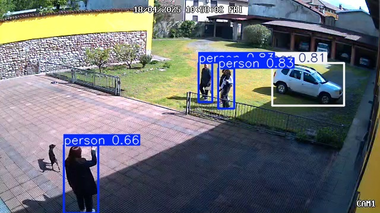

# Reolink Detect AI 📹 🤖

[](https://opensource.org/licenses/MIT)
[](https://www.python.org/downloads/)
[](https://github.com/ultralytics/ultralytics)

A Python application using OpenCV and YOLOv8 to monitor Reolink (or other RTSP) camera streams for motion, perform object detection (person, car, etc.), and send email alerts with detected images.

<p align="center">
  
</p>
<p align="center"><em>Example of Reolink Detect AI detecting multiple people and a car via RTSP stream.</em></p>

## ✨ Features

* Connects to multiple RTSP camera streams simultaneously
* Two-phase detection: motion detection followed by YOLOv8 object detection
* Configurable detection classes and confidence thresholds
* Saves captured frames and annotated detection images
* Email alerts with annotated images
* Cooldown periods to prevent alert spam
* Creation of a personalized dataset for fine-tuning

## 🛠️ Installation

1. **Clone the repository and enter directory**
2. **Create and activate a virtual environment:**
   ```bash
   python -m venv venv
   source venv/bin/activate  # On Windows: venv\Scripts\activate
   ```
3. **Install dependencies:**
   ```bash
   pip install -r requirements.txt
   ```
4. **Configure the application:**
   ```bash
   cp .env.example .env
   ```
   Edit `.env` with your camera details and other settings.

## ⚙️ Configuration

Key configuration options in `.env`:

| Setting | Description | Default |
|---------|-------------|---------|
| `CAMERA_1_RTSP` | RTSP URL for camera 1 | *Required* |
| `PIXEL_DIFF_THRESHOLD` | Motion sensitivity | 25 |
| `YOLO_CONFIDENCE_THRESHOLD` | Detection confidence threshold | 0.7 |
| `DETECTION_COOLDOWN` | Seconds between detection cycles | 5 |
| `SMTP_SERVER` | SMTP server for email alerts | *Optional* |

## 🚀 Usage

Run the application directly:
```bash
python main.py
```

### Running as a Systemd Service (Linux)

This method is for running the application as a background service on **Linux distributions that use systemd** (like Ubuntu, Debian, Fedora, CentOS 7+, etc.).
To run the application reliably in the background on a Linux system using systemd:

1.  **Create a systemd service file:**
    Use a text editor (like `nano`) with `sudo` to create the service file:
    ```bash
    sudo nano /etc/systemd/system/reolink-detectai.service
    ```

2.  **Paste the following configuration** into the file. **Important:** Replace `/path/to/reolink-detectai` with the actual absolute path to your project directory and `your_username` with the user you want the service to run as.

    ```ini
    [Unit]
    Description=Reolink DetectAI Application
    After=network.target

    [Service]
    Type=simple
    User=your_username
    WorkingDirectory=/path/to/reolink-detectai
    ExecStart=/path/to/reolink-detectai/venv/bin/python /path/to/reolink-detectai/main.py
    Restart=on-failure
    RestartSec=5
    # Optional: Standard output and error logging
    # StandardOutput=file:/path/to/reolink-detectai/logs/service.log
    # StandardError=file:/path/to/reolink-detectai/logs/service.err.log

    [Install]
    WantedBy=multi-user.target
    ```
    *   `WorkingDirectory`: Ensures the script runs from the correct directory.
    *   `ExecStart`: Specifies the command to run the application using the virtual environment's Python interpreter.
    *   `User`: Sets the user under which the process will run.
    *   `Restart`: Configures the service to restart automatically if it fails.
    *   Uncomment and adjust the `StandardOutput`/`StandardError` lines if you want to redirect logs to specific files instead of the system journal.

3.  **Reload the systemd daemon:**
    This makes systemd aware of the new service file.
    ```bash
    sudo systemctl daemon-reload
    ```

4.  **Enable the service:**
    This ensures the service starts automatically on system boot.
    ```bash
    sudo systemctl enable reolink-detectai.service
    ```

5.  **Start the service:**
    You can start the service immediately without rebooting.
    ```bash
    sudo systemctl start reolink-detectai.service
    ```

6.  **Check the service status (optional):**
    Verify that the service is running correctly.
    ```bash
    sudo systemctl status reolink-detectai.service
    ```
    You can also view logs using `journalctl`:
    ```bash
    sudo journalctl -u reolink-detectai.service -f
    ```

## 📜 License

This project is licensed under the MIT License - see the [LICENSE](LICENSE) file for details.

## 🙏 Acknowledgements

- [Ultralytics YOLOv8](https://github.com/ultralytics/ultralytics)
- [OpenCV](https://opencv.org/)
- [Reolink](https://reolink.com/) (works with any RTSP stream)
